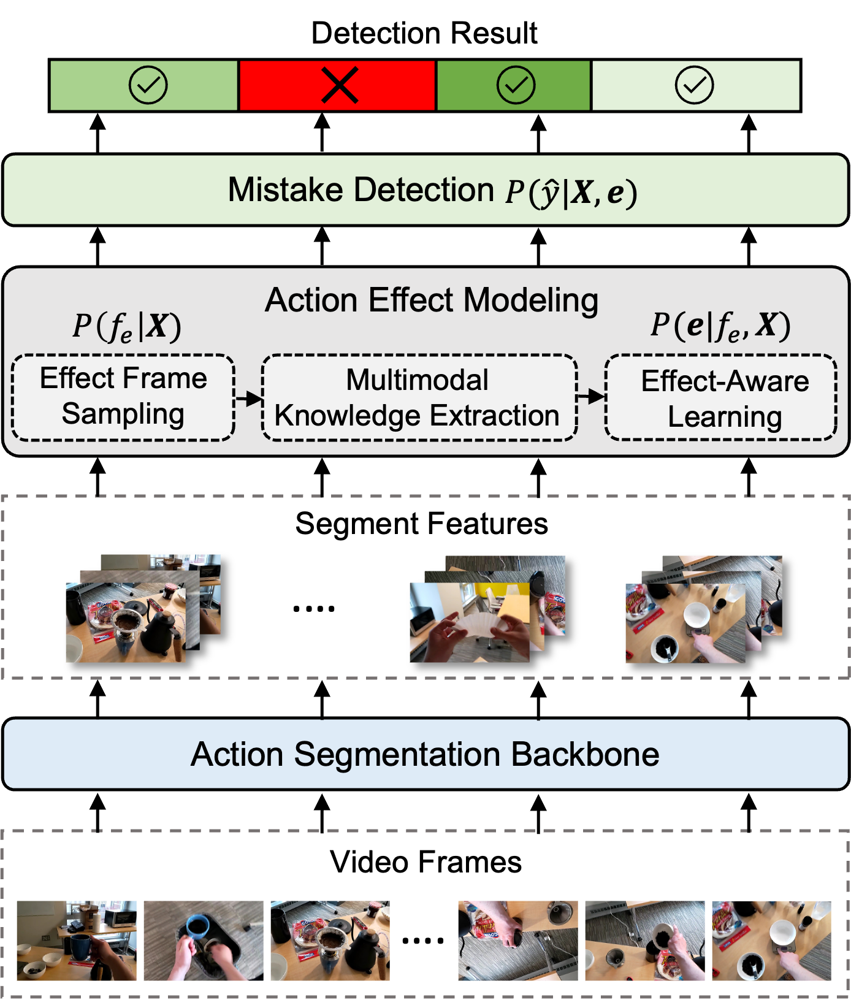

# Procedural Mistake Detection via Action Effect Modeling

**[[Project Page](https://wenliangguo.github.io/Mistake_Detection)] [[Paper](https://arxiv.org/abs/2512.03474)]**

[Wenliang Guo](https://wenliangguo.github.io/), [Yujiang Pu](https://www.yujiangpu.com/), [Yu Kong](https://www.egr.msu.edu/~yukong/).

🔥 **Update**: [07/07/2026] We included data preparation into this repository, including the code for object detection, scene-graph generation and feature extraction.

🔥 **Update**: [07/04/2026] We included CaptainCook4D dataset into this repository, including the code for data preparation, model training and evaluation.

<p align="center">
  
</p>

**Abstract**: Mistake detection in procedural tasks is essential for building intelligent systems that support learning and task execution. Existing approaches primarily analyze how an action is performed, while overlooking what it produces, i.e., the action effect. Yet many errors manifest not in the execution itself but in the resulting outcome, such as an unintended object state or incorrect spatial arrangement. To address this gap, we propose Action Effect Modeling (AEM), a unified framework that jointly captures action execution and its outcomes through a probabilistic formulation. AEM first identifies the outcome of an action by selecting the most informative effect frame based on semantic relevance and visual quality. It then extracts complementary cues from visual grounding and symbolic scene graphs, aligning them in a shared latent space to form robust effect-aware representations. To detect mistakes, we further design a prompt-based detector that incorporates task-specific prompts and aligns each action segment with its intended execution semantics. Our approach achieves state-of-the-art performance on the EgoPER and CaptainCook4D benchmarks under the challenging one-class classification (OCC) setting. These results demonstrate that modeling both execution and outcome yields more reliable mistake detection, and highlight the potential of effect-aware representations to benefit a broader range of downstream applications.

## Environment Setup

### Step 1. Install the conda environment

We provide two options to set up the environment.

Option 1: Using the YML file

```
conda env create -f environment.yml
conda activate ED
```

This environment is configured for our server with an NVIDIA RTX A6000 GPU; it pins PyTorch 1.13.0 built for CUDA 11.7 (`cu117`), which runs on newer CUDA drivers (e.g. 12.x).

Option 2: Manual configuration. If Option 1 does not work on your machine, manually install the following main packages and others as needed:

- Python: 3.10
- PyTorch and CUDA: refer to the [official link](https://pytorch.org/get-started/previous-versions/) to find a compatible version. We strongly recommend PyTorch 1.x, as PyTorch 2.x may cause errors.
- Main packages:

```
tensorboardx, pyyaml, numpy, pandas, open-clip-torch, torchvision, torch-geometric, opencv-python, scikit-learn, pillow
```

### Step 2. Compile NMS operations

```bash
cd ./libs/utils
python setup.py install --user
cd ../..
```

Note: recompile whenever you update PyTorch.

## Data Preparation

The `detection/`, `scene_graph_npy/` and `scene_graph_json/` folders are already
provided in this repo, so the steps below only cover the data you need to
download. If you want to **regenerate** the VLM object detections and symbolic
scene graphs yourself, see [`data_preparation/`](data_preparation/) — a set of
self-contained scripts (one pipeline per dataset) with a step-by-step README.

### EgoPER

Step 1: Video data and annotations. Follow the instructions on the [EgoPER website](https://github.com/robert80203/EgoPER_official) to request them.

Step 2: Video features. Two options:

- Option 1: follow the [EgoPER website](https://github.com/robert80203/EgoPER_official) to extract I3D features into the `data/egoper/` folder.
- Option 2: download pre-extracted I3D features (~2.9GB) from our [Google Drive](https://drive.google.com/drive/folders/1mIkjDdfPbMiG1C5S_qa8JwD9Wf-hvsDR?usp=sharing) and extract them into the `data/egoper/` folder.

Step 3 (optional, training only): Effect frames. Skip this step for evaluation. Otherwise, download the effect frames (~4GB) from our [Google Drive](https://drive.google.com/file/d/1d3GkObtZ-DLNsXjw4i5Lm0mfBlmatmK0/view?usp=sharing) and extract them into the `data/egoper/effect_frames/` folder.

All EgoPER data lives under `data/egoper/`. Videos can be saved anywhere, as they are only used for feature extraction and visualization. The `detection/`, `scene_graph_npy/` and `scene_graph_json/` folders are already provided in this repo; `annotation.json`, `active_object.json`, the per-task feature folders, and `effect_frames/` come from the downloads above. Organize the folder as follows:

```
AEM/data/egoper/
├── annotation.json                      # segment-level action / error annotations (all tasks)
├── active_object.json                   # active-object boxes (used by the GCN backbone)
├── coffee/                              # one folder per task: coffee, oatmeal, pinwheels, quesadilla, tea
│   ├── training.txt / validation.txt / test.txt
│   └── features_10fps/                  # I3D features, e.g. coffee_u1_a1_error_001.npy
├── oatmeal/ ...
├── detection/<task>_detection.json      # VLM object detections   (effect model, training only)
├── scene_graph_npy/<task>_gpt4o.npy     # symbolic scene graphs    (effect model, training only)
├── scene_graph_json/<task>_gpt4o.json   # human-readable scene graphs
└── effect_frames/effect_frames_<task>.npz   # effect frames        (effect model, training only)
```

Note: the default data path is `data/egoper`. If you customize the folder location, update `root_dir` in the config (e.g. `configs/coffee.yaml`).

### CaptainCook4D

Step 1: Video data and annotations. Download the videos from the [CaptainCook4D repo](https://github.com/CaptainCook4D/downloader). The processed annotations and step mappings are already provided in this repo.

Step 2: Video features. Two options:

- Option 1: extract I3D features at 10 fps into the `data/captaincook4d/I3D_features_10fps/` folder.
- Option 2: download our pre-extracted I3D features (~13GB) from our [Google Drive](https://drive.google.com/drive/folders/1bvEsZ6oHfk__oksLwY463FyrxIdE_3FI) and extract them under the `data/captaincook4d` folder.

Step 3 (optional, training only): Effect frames. Skip this step for evaluation. Otherwise, download the effect frames (~175MB) from our [Google Drive](https://drive.google.com/file/d/1Eg2EIsjnshJnMQ41DnTavyjBWfv6WbK7/view?usp=drive_link) and extract them into the `data/captaincook4d/effect_frames/` folder.

All CaptainCook4D data lives under `data/captaincook4d/`. The `detection/`, `scene_graph_npy/` and `scene_graph_json/` folders and the annotation / step-mapping `*.json` files are already provided in this repo; the I3D features and effect frames come from the downloads above. Organize the folder as follows:

```
AEM/data/captaincook4d/
├── non_error_samples_processed.json     # per-recipe error-free recordings (train split)
├── error_samples_processed.json         # per-recipe erroneous recordings  (test split)
├── activity_step_collection.json        # recipe -> step-id -> step text
├── step_id_mapping.json                 # per-recipe step-id remapping (labels use the mapped ids)
├── id_activity_mapping.json             # recipe id -> recipe name
├── I3D_features_10fps/                   # I3D features, e.g. 1_10_360p.npy
├── detection/openset_detection_ccp4d.json   # VLM object detections   (effect model, training only)
├── scene_graph_npy/scene_graph.npy      # symbolic scene graphs        (effect model, training only)
├── scene_graph_json/scene_graph.json    # human-readable scene graphs
└── effect_frames/<recipe_video>/<seg>/<frame>.jpg   # effect frames    (effect model, training only)
```

Note: the default data path is `data/captaincook4d`. If you customize the folder location, update `root_dir` (and `features_subdir`) in `configs/ccp4d.yaml`. The effect frames are the images referenced by `img_path` in `detection/openset_detection_ccp4d.json`, resolved relative to `root_dir`.

## Training

### EgoPER

```bash
CUDA_VISIBLE_DEVICES=0 python train.py configs/coffee.yaml --output exp_name --use_gcn
```

Repeat for the other tasks (`oatmeal`, `pinwheels`, `quesadilla`, `tea`). Checkpoints are saved to `checkpoints/egoper/<config>_<exp_name>/` (set by `output_folder` in the config).

### CaptainCook4D

Select the task with `dataset.task` in `configs/ccp4d.yaml` (recipe ids are listed in `data/captaincook4d/id_activity_mapping.json`; `task: '0'` pools all recipes).

```bash
CUDA_VISIBLE_DEVICES=0 python train.py configs/ccp4d.yaml --output exp_name
```

Repeat for each task separately. Checkpoints are saved to `checkpoints/ccp4d/<config>_<exp_name>/` (set by `output_folder` in the config).

## Evaluation

For each dataset you can either evaluate your own trained checkpoint or use our provided checkpoints.

### EgoPER

Download the per-task checkpoints from our [Google Drive](https://drive.google.com/drive/folders/1O5BNeC17pse4O2T4QDmo-ntrcbR6uLed?usp=sharing) and place them under `checkpoints/egoper/`:

```
AEM/checkpoints/egoper/
├── coffee.pth.tar
├── oatmeal.pth.tar
├── pinwheels.pth.tar
├── quesadilla.pth.tar
└── tea.pth.tar
```

Evaluate a task (use `--use_gcn`, same as training):

```bash
CUDA_VISIBLE_DEVICES=0 python eval.py configs/coffee.yaml checkpoints/egoper/coffee.pth.tar --use_gcn
```

Replace the config and checkpoint to evaluate the other tasks.

### CaptainCook4D

Download the per-recipe checkpoints from our [Google Drive](https://drive.google.com/drive/folders/1ICLCbwLSid2UqVgzIKbScFkVNMf1Gwvm) and place them under `checkpoints/ccp4d/`:

```
AEM/checkpoints/ccp4d/
├── recipe_1_MicrowaveEggSandwich.pth.tar
├── recipe_2_DressedUpMeatballs.pth.tar
├── ...
```

Evaluate a recipe (without `--use_gcn`). Set `dataset.task` in `configs/ccp4d.yaml` to the recipe id that matches the checkpoint:

```bash
CUDA_VISIBLE_DEVICES=0 python eval.py configs/ccp4d.yaml checkpoints/ccp4d/recipe_1_MicrowaveEggSandwich.pth.tar
```

## Citation

```bibtex
@inproceedings{guo2026procedural,
  title={Procedural Mistake Detection via Action Effect Modeling},
  author={Wenliang Guo and Yujiang Pu and Yu Kong},
  booktitle={The Fourteenth International Conference on Learning Representations},
  year={2026},
  url={https://openreview.net/forum?id=HsB5EuQOoS}
}
```

## Acknowledgements

Our codebase builds upon the open-source projects: [ActionFormer](https://github.com/happyharrycn/actionformer_release) and [EgoPER](https://github.com/robert80203/EgoPER_official).
